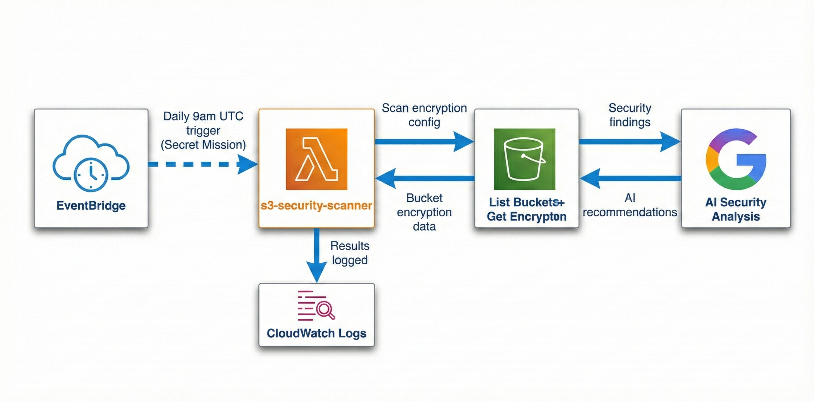

# AI S3 Security Scanner

AI S3 Security Scanner is a serverless AWS security monitoring system. It automatically scans S3 buckets for encryption settings, leverages Gemini AI to analyze security risks, and provides intelligent security insights.

## 🚀 Key Features

- **Automated S3 Scanning**: Periodically checks all S3 buckets in your account for server-side encryption.
- **AI-Powered Analysis**: Uses Google Gemini AI (`gemini-2.0-flash-exp`) to explain the security implications of unencrypted buckets.
- **Actionable Insights**: Provides clear, human-readable recommendations for immediate security remediation.
- **Serverless Architecture**: Built with AWS Lambda for cost-effectiveness and scalability.
- **Automated Scheduling**: Configured to run automatically every 12 hours using Amazon EventBridge.

## 🏗️ Architecture

The system follows a serverless architecture as shown below:



1. **EventBridge**: Triggers the Lambda function on a schedule.
2. **Lambda Function**: Executes the `s3_scanner.py` script.
3. **S3**: The target of the security scan.
4. **Gemini AI**: Analyzes the findings and generates a security report.

## 📋 Prerequisites

- AWS Account with appropriate permissions (S3 Read, Lambda Execution).
- Python 3.9+ environment.
- Google Gemini API Key.

## 🛠️ Installation & Setup

1. **Clone the Repository**:

   ```bash
   git clone <repository-url>
   cd AI-Security-Scanner-for-AWS-S3
   ```

2. **Install Dependencies**:
   Install the required Python packages:

   ```bash
   pip install -r requirements.txt -t package/
   ```

3. **Configure Environment Variables**:
   Set your Gemini API key:

   ```bash
   export GOOGLE_API_KEY="your-google-api-key"
   ```

4. **Deploy to AWS Lambda**:
   - Package the code and dependencies into `s3_scanner.zip`.
   - Upload the ZIP file to AWS Lambda.
   - Set the `GOOGLE_API_KEY` environment variable in the Lambda configuration.

5. **Schedule Scans**:
   Create an EventBridge rule to trigger the Lambda function every 12 hours.

## 🔍 Usage

Once deployed, the Lambda function will run automatically. You can also trigger it manually from the AWS Console to see the results immediately in the CloudWatch logs.


## 🛡️ Security Remediation

The AI analysis will categorize findings and suggest immediate actions, such as enabling **AES256** or **aws:kms** encryption on vulnerable buckets.

---

_Developed as an AI-enhanced security utility for AWS infrastructure._
